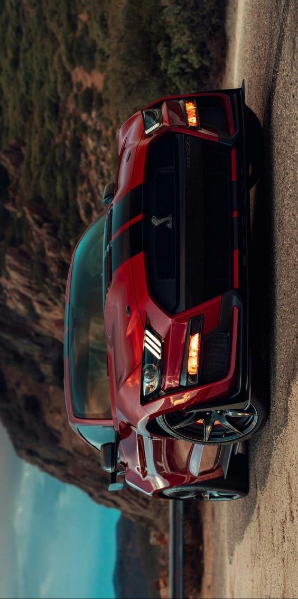
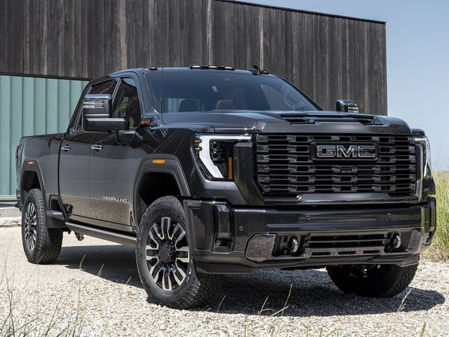
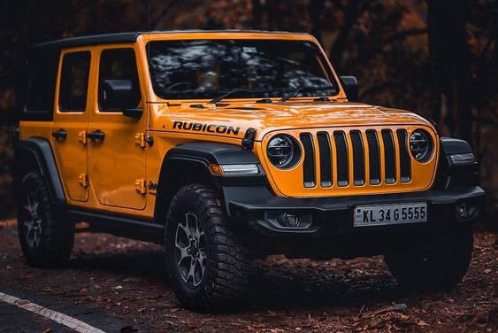
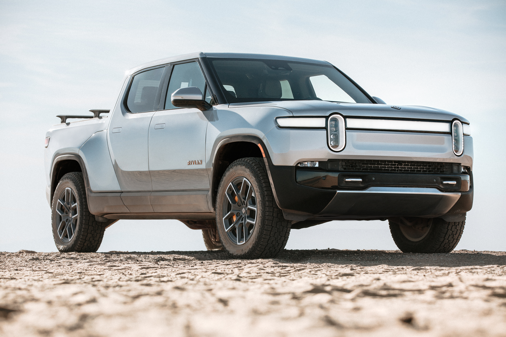
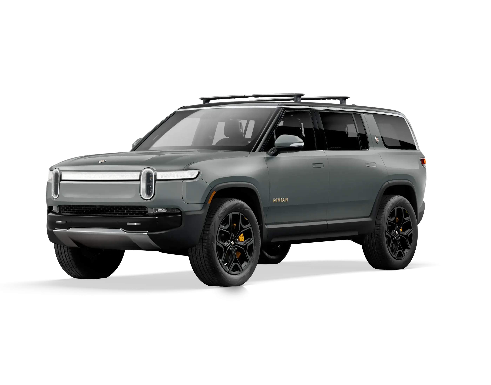

<html lang="es">
<head>
	<link rel="icon" type="text/css" href="Camaro.ico">
    <meta charset="UTF-8">
    <meta name="viewport" content="width=device-width, initial-scale=1.0">   
</head>
<body>

<header>
    <h1>Carros Americanos</h1>
</header>

    <section>
        <h1>Historia de los Carros Americanos</h1>
        
Los carros americanos, también conocidos como automóviles estadounidenses, son vehículos diseñados y fabricados principalmente en los Estados Unidos por empresas automotrices estadounidenses. Estos vehículos han sido un símbolo de innovación, potencia y estilo a lo largo de la historia. Aquí se presentan algunos de los aspectos clave que definen a los carros americanos:

<strong><h2>1. Diseño y Estilo</h2></strong>

Grande y Audaz: Los carros americanos tradicionalmente se caracterizan por su tamaño grande y un diseño audaz, con líneas robustas y una presencia imponente en la carretera.
Diversidad de Estilos: Desde los clásicos muscle cars con sus diseños agresivos hasta los elegantes sedanes y SUVs modernos, los carros americanos abarcan una amplia gama de estilos.

<strong><h2> 2.Rendimiento </h2></strong>

Motores Potentes: Son conocidos por sus motores V8 potentes que ofrecen un alto rendimiento y velocidad. Los muscle cars, en particular, son famosos por su aceleración y potencia.
Variedad de Opciones: Desde vehículos compactos y eficientes hasta camionetas y SUVs de gran capacidad, los carros americanos ofrecen una amplia variedad de opciones para diferentes necesidades y preferencias.

<strong><h2>3. Innovación Tecnológica</h2></strong>

Avances en Seguridad: Los fabricantes americanos han sido pioneros en la implementación de tecnologías de seguridad avanzadas, como bolsas de aire, frenos antibloqueo (ABS), y sistemas de asistencia al conductor.
Tecnología de Infoentretenimiento: Incorporan sistemas de infoentretenimiento de última generación, con conectividad avanzada y funciones integradas para una experiencia de conducción más cómoda y entretenida.

<strong><h2>4. Cultura e Influencia</h2></strong>

Impacto Cultural: Los carros americanos han sido inmortalizados en la cultura popular a través de películas, música y televisión. Modelos icónicos como el Ford Mustang y el Chevrolet Camaro son símbolos de libertad y aventura.
Eventos y Comunidades: Existen numerosos eventos y comunidades dedicadas a los carros clásicos americanos, donde los entusiastas se reúnen para exhibir y admirar estos vehículos.

<strong><h2>5. Fabricantes Principales</h2></strong>

Ford Motor Company: Conocido por modelos como el Mustang y el F-150, Ford ha sido un líder en innovación y producción en masa desde sus inicios.
General Motors (GM): Con marcas como Chevrolet, GMC y Cadillac, GM ha ofrecido una amplia gama de vehículos que combinan rendimiento y lujo.
Stellantis (anteriormente Chrysler): Incluye marcas icónicas como Jeep, Dodge y Ram, conocidas por sus vehículos robustos y de alto rendimiento.

<strong><h2>6. Sostenibilidad y Futuro</h2></strong>

Vehículos Eléctricos e Híbridos: En respuesta a la creciente demanda de sostenibilidad, los fabricantes americanos están invirtiendo en el desarrollo de vehículos eléctricos e híbridos, como el Chevrolet Bolt EV y el Ford F-150 Lightning.
Tecnología Autónoma: Están avanzando en la investigación y desarrollo de tecnologías de conducción autónoma para mejorar la seguridad y la eficiencia en la carretera.

    </section>

<section>
        <h1>Características de los Carros Americanos</h1>
<strong><h2>1. Tamaño y Potencia:</h2></strong>

Los vehículos estadounidenses, como las camionetas y SUVs, son conocidos por su tamaño grande y motores potentes (V6 y V8), lo que les permite ofrecer un alto rendimiento y capacidad de remolque.

<strong><h2>2. Diseño Robusto:</h2></strong>

El diseño de los carros americanos tiende a ser robusto y agresivo, con líneas musculares y un aspecto imponente. Modelos como el Ford Mustang y el Chevrolet Camaro son ejemplos icónicos.

<strong><h2>3. Comodidad Interior:</h2></strong>

Los autos americanos priorizan la comodidad, con interiores espaciosos, asientos amplios y características de lujo en los modelos de alta gama.

<strong><h2>4. Tecnología Avanzada:</h2></strong>

Están equipados con las últimas tecnologías en sistemas de infoentretenimiento, conectividad y seguridad, como asistentes de conducción, frenado automático y sistemas de navegación avanzados.

<strong><h2>5. Capacidad de Remolque:</h2></strong>

Las camionetas y SUVs están diseñadas para soportar cargas pesadas y remolcar grandes volúmenes, siendo populares para el trabajo y el ocio.

<strong><h2>6. Cultura de Muscle Cars:</h2></strong>

Los "muscle cars" como el Ford Mustang, Chevrolet Camaro y Dodge Charger son emblemáticos en la cultura automovilística estadounidense, caracterizados por sus potentes motores y diseño deportivo.

    </section>
<section>
        <h1>Fabricantes Principales</h1>
        <ol>
<li><strong><h2>Ford Motor Company:</h2>
<strong><h3>Modelos Icónicos:</h3></strong>

Ford F-Series, Mustang, Explorer.

<strong><h3>Descripción:</h3></strong>

Uno de los fabricantes más antiguos y grandes de Estados Unidos, conocido por sus camionetas robustas y vehículos deportivos. Ford ha sido pionero en tecnologías como la producción en masa y está invirtiendo significativamente en vehículos eléctricos.

<li><strong><h2>General Motors (GM):</h2>
<strong><h3>Marcas Principales:</h3></strong>

Chevrolet, GMC, Cadillac, Buick.

<strong><h3>Descripción:</h3></strong>

Un conglomerado automotriz que produce una amplia gama de vehículos, desde autos económicos hasta SUVs y camionetas de lujo. Chevrolet es conocida por sus modelos accesibles y deportivos, mientras que Cadillac es sinónimo de lujo.

<li><strong><h2>Stellantis (anteriormente Fiat Chrysler Automobiles):</h2>
<strong><h3>Marcas Principales:</h3></strong>

Jeep, Dodge, Ram, Chrysler.

<strong><h3>Descripción:</h3></strong>

Conocido por sus camionetas y SUVs robustos, como las camionetas Ram y los todoterrenos Jeep. Dodge es famoso por sus muscle cars, como el Charger y el Challenger.

<li><strong><h2>Tesla, Inc.:</h2>
<strong><h3>Modelos Icónicos:</h3></strong>

Model S, Model 3, Model X, Model Y.

<strong><h3>Descripción:</h3></strong>

Líder en vehículos eléctricos y tecnologías de conducción autónoma. Tesla ha revolucionado la industria automotriz con sus innovaciones y ha establecido un estándar alto para los vehículos eléctricos en términos de rendimiento y autonomía.

<li><strong><h2>Rivian:</h2>
<strong><h3>Modelos Icónicos:</h3></strong>

R1T (camioneta), R1S (SUV).

<strong><h3>Descripción:</h3></strong> 

Un fabricante emergente de vehículos eléctricos, conocido por sus camionetas y SUVs eléctricos con capacidades todoterreno avanzadas. Rivian está atrayendo atención por sus innovaciones y enfoque en la sostenibilidad.

<li><strong><h2>Lucid Motors:</h2>
<strong><h3>Modelos Icónicos:</h3></strong>

Lucid Air.

<strong><h3>Descripción:</h3></strong>

Fabricante de vehículos eléctricos de lujo, conocido por su sedán Lucid Air, que ofrece un diseño elegante, alta autonomía y tecnologías avanzadas. Lucid se enfoca en el mercado de lujo y compite directamente con Tesla en el segmento de vehículos eléctricos de alta gama.

</section>

<section>
        <h2>Más Información</h2>
        
Para ver un video sobre los carros americanos, haz clic en el siguiente enlace:

        
<link rel="stylesheet" href="https://cdnjs.cloudflare.com/ajax/libs/font-awesome/6.0.0-beta3/css/all.min.css"><i class="fab fa-youtube youtube-icon"></i><a href="https://www.youtube.com/watch?v=zZ-GnGl2QYo" target="_blank">Video en YouTube sobre Carros Americanos</a>

        
<link rel="stylesheet" href="https://cdnjs.cloudflare.com/ajax/libs/font-awesome/6.0.0-beta3/css/all.min.css"><i class="fab fa-youtube youtube-icon"></i><a href="https://www.youtube.com/watch?v=aPHn_yiWino2w" target="_blank">Video en YouTube sobre Carros Americanos</a>

        
Para buscar más información sobre los carros americanos, visita este enlace de Google:

        
<link rel="stylesheet" href="https://cdnjs.cloudflare.com/ajax/libs/font-awesome/6.0.0-beta3/css/all.min.css"><i class="fab fa-google google-icon"></i><a href="https://es.wikipedia.org/wiki/Historia_de_la_automoci%C3%B3n" target="_blank">Buscar en Google sobre Carros Americanos</a>

    </section>
<!-- Aviso de Cookies -->

    Utilizamos cookies para mejorar tu experiencia en nuestro sitio. 
    <a href="Cookies.html" target="_blank" style="color: #fff; text-decoration: underline;">Leer más</a>
    <button onclick="acceptCookies()">Aceptar</button>

<!-- Incluir Font Awesome -->

<section>
<!-- Footer con Enlaces Legales -->
<footer>

&copy; 2024 Carros Americanos. Todos los derechos reservados.

<a href="aviso de privacidad.html" style="color: #fff;">Aviso de Privacidad</a> |
<a href="Terminos y Condiciones.html" style="color: #fff;">Términos y Condiciones</a> |
<a href="Politica de cookies.html" style="color: #fff;">Política de Cookies</a>

</footer>
</section>
